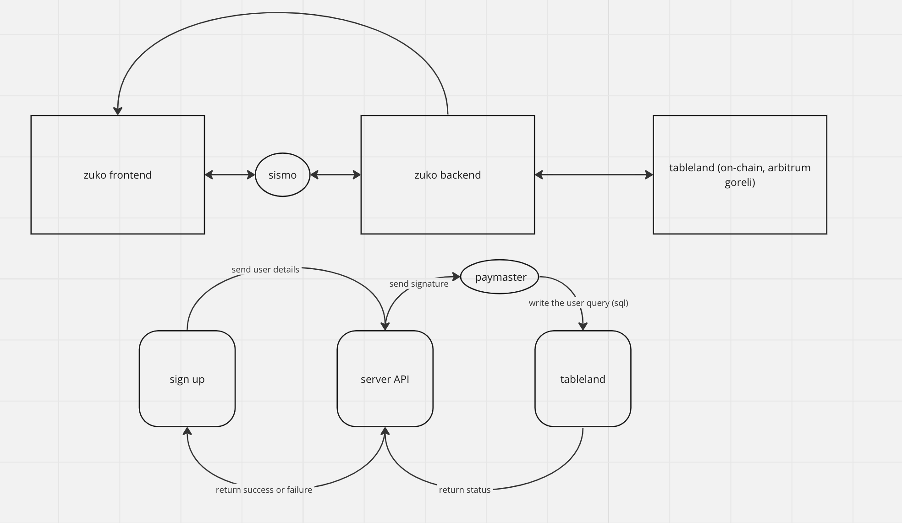

## Zuko


Zuko is a permissionless, privacy-centric social dApp powered by ZK proofs. Connect anonymous users to communities using Sismo Connect and Tableland.

## TL;DR

Zuko is for individuals who value their privacy and seek a secure and confidential space to engage within their communities without revealing their identity.



## Getting Started

### Installation

Clone the repository

```
git clone https://github.com/usezuko/zuko-zk.git
```

### Deployment

First install the dependencies with the following command:

```
bun install
```

Thereafter run the following command to run Zuko locally:

```
bun run dev
```
## Add contributing guidelines
## Update installation steps
## Add troubleshooting section
## Add contributing guidelines
## Update installation steps
## Add troubleshooting section
## Add contributing guidelines
## Update installation steps
## Add troubleshooting section
## Improve architecture documentation
## Add security considerations
## Update deployment instructions
